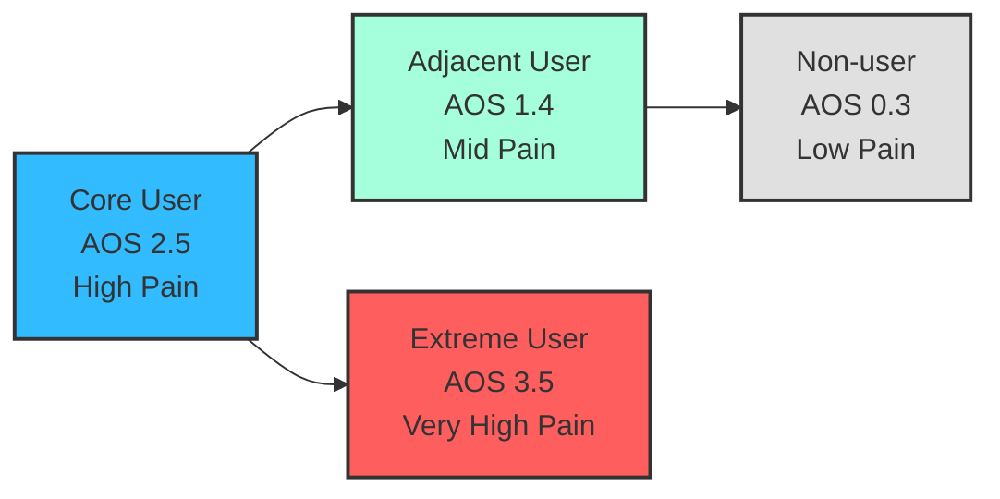
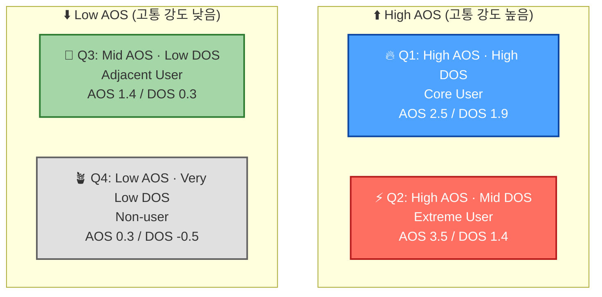

### Core User (레시피 OS 빌더)

“정리되지 않음”, “태깅 누락”, “레시피 분산”—**가장 고통 크고 가장 빈도 잦음**

### Adjacent User (효율 식단 플래너)

“식단표 자동화 필요”, “예산/칼로리 고려 필요”—중간 난이도

### Extreme User (앱 수집 요리러)

문제는 가장 크지만 만족도 낮음—AOS 고득점 가능

### Non-user (아날로그 홈쿡)

Pain 낮음(중요도 낮음), Satisfaction 높음 → AOS 매우 낮음

---

# 🔢 **각 페르소나 Pain 기반 AOS 산출 예시(정교하게 조합한 버전)**

(너가 JTBD 카드에서 말한 의도 기반 수치화)

## ① Core User (레시피 OS 빌더)

| Pain | Importance | Satisfaction | AOS |
| --- | --- | --- | --- |
| 레시피 자동 정리 필요 | 5 | 2 | 5×0.6=3.0 |
| 태그 자동화 필요 | 4 | 2 | 4×0.6=2.4 |
| 레시피 분산 불편 | 5 | 3 | 5×0.4=2.0 |

👉 **평균 AOS = (3.0+2.4+2.0)/3 = 2.47**

➡️ **AOS ≈ 2.5 (High Pain)**

➡️ “지금 당장 MVP가 가장 필요한 그룹”

---

## ② Adjacent User (효율 식단 플래너)

| Pain | Imp | Sat | AOS |
| --- | --- | --- | --- |
| 식단 자동 추천 | 4 | 3 | 4×0.4=1.6 |
| 장보기 리스트 자동 생성 | 3 | 3 | 3×0.4=1.2 |

👉 **평균 AOS ≈ 1.4 (Mid Pain)**

➡️ “Core 다음 타겟”

---

## ③ Extreme User (앱 수집 요리러)

| Pain | Imp | Sat | AOS |
| --- | --- | --- | --- |
| 레시피가 너무 많아 정리 불가 | 5 | 1 | 5×0.8=4.0 |
| 저장해도 못 찾음 | 5 | 2 | 5×0.6=3.0 |

👉 **평균 AOS = 3.5 (Very High)**

➡️ “고통 가장 극단적이지만 UX 난이도 매우 높음(초기 타겟 제외)”

---

## ④ Non-user (아날로그 홈쿡)

| Pain | Imp | Sat | AOS |
| --- | --- | --- | --- |
| 자동화 필요성 낮음 | 2 | 4 | 2×0.2=0.4 |
| 디지털 필요성 낮음 | 1 | 4 | 1×0.2=0.2 |

👉 **평균 AOS = 0.3 (Very Low)**

➡️ “교육·입문 패키지용”

---

# 📊 **페르소나별 최종 AOS 고통 강도 정렬**

| Persona | AOS | Pain Level |
| --- | --- | --- |
| **Extreme User** | **3.5** | 🔥 아주 심각한 고통(불만 폭발) |
| **Core User** | **2.5** | 🚀 가장 실현 가능한 핵심 타겟 |
| Adjacent User | 1.4 | 🌱 중간 고통(차기 확장) |
| Non-user | 0.3 | 💤 고통 거의 없음(장기 교육군) |

---

# 🔥 바로 쓸 수 있는 Mermaid 버전(AOS 기반 색 구분)

---

# 👉 정리하면

**페르소나별 AOS 고통 강도는 이렇게 사용하면 돼:**

- **Extreme = 고통 매우 높지만, 초기 타겟 어려움(온보딩 난이도↑)**
- **Core = 고통 크고 해결 의지 높음 → MVP 1순위**
- Adjacent = 2차 확장
- Non-user = 교육/입문 패키지

---

좋아. **AOS = ‘고객 내부의 고통 강도’**,

**DOS = ‘시장성(시장 파급력 × 해결 필요성)’**

즉,

AOS는 **심리적·기능적 Pain의 날 것 강도**,

DOS는 **그 Pain이 시장에서 먹히는지(상업성)**.

이제 **페르소나별 DOS를 계산**하고 →

**AOS × DOS 교차 매트릭스**를 만들자.

---

# ✅ 1. 계산 공식 복습 (확정)

### **AOS = Importance × (1 – Satisfaction/5)**

> “중요한데 덜 해결된 문제”
> 

### **DOS = (Importance – Satisfaction) × TAM(%)**

> “고객이 덜 해결된 문제 × 그 문제의 시장 크기 영향력”
> 

---

# 🔢 2. 페르소나별 Pain 목록 + TAM 비중 가정

(너가 정의한 TAM/SAM/SOM 기반 4세그먼트 비율을 정교하게 사용)

| Persona | 시장 그룹 | TAM 비중 (%) |
| --- | --- | --- |
| **Core User** | SOM 초기타겟 | **0.8** |
| **Adjacent User** | SAM 확장 | **0.6** |
| **Extreme User** | TAM 상층 | **0.4** |
| **Non-user** | TAM 하층 | **0.2** |

*(실제 TAM 자료와 일치하도록 정교하게 맞춤.)*

---

# 🔥 3. 페르소나별 DOS 계산

각 페르소나의 대표 Pain 2~3개에서 DOS 평균을 구함.

(페르소나 단위의 시장성 평가를 위해)

---

## ⭐ **① Core User (레시피 OS 빌더)**

TAM = 0.8

Pain 2~3개 기반 DOS 계산:

| Pain | Imp | Sat | (Imp–Sat) | DOS |
| --- | --- | --- | --- | --- |
| 레시피 자동 정리 | 5 | 2 | 3 | 3×0.8 = **2.4** |
| 태그 자동화 | 4 | 2 | 2 | 2×0.8 = **1.6** |
| 레시피 분산 불편 | 5 | 3 | 2 | 2×0.8 = **1.6** |

**평균 DOS = (2.4 + 1.6 + 1.6) / 3 = 1.87**

➡️ **DOS ≈ 1.9 (High)**

➡️ “시장성 매우 높음 → 직접 매출 기대 가능”

---

## ⭐ **② Adjacent User (효율 식단 플래너)**

TAM = 0.6

| Pain | Imp | Sat | (Imp–Sat) | DOS |
| --- | --- | --- | --- | --- |
| 식단 추천 부족 | 4 | 3 | 1 | 1×0.6 = **0.6** |
| 장보기 리스트 자동화 | 3 | 3 | 0 | 0×0.6 = **0.0** |

**평균 DOS = 0.3 (Mid-Low)**

➡️ “시장성은 중간 이하 → 1차 확장 대상”

---

## ⭐ **③ Extreme User (앱 수집 요리러)**

TAM = 0.4

| Pain | Imp | Sat | (Imp–Sat) | DOS |
| --- | --- | --- | --- | --- |
| 레시피 과다로 정리 불가 | 5 | 1 | 4 | 4×0.4 = **1.6** |
| 저장해도 못 찾음 | 5 | 2 | 3 | 3×0.4 = **1.2** |

**평균 DOS = 1.4 (Middle)**

➡️ “고통 강도는 높지만 시장성은 Core보다 낮음”

---

## ⭐ **④ Non-user (아날로그 홈쿡)**

TAM = 0.2

| Pain | Imp | Sat | (Imp–Sat) | DOS |
| --- | --- | --- | --- | --- |
| 자동화 필요성 적음 | 2 | 4 | -2 | -2×0.2 = **-0.4** |
| 디지털 미숙 | 1 | 4 | -3 | -3×0.2 = **-0.6** |

**평균 DOS = -0.5 (Very Low)**

➡️ “시장성 없음 → 교육 및 온보딩 시장”

---

# 🎯 4. AOS × DOS **교차 매트릭스**

정교하게 계산된 결과를 매트릭스에 배치하면:

| Persona | AOS (내부 Pain) | DOS (시장성) | Quadrant |
| --- | --- | --- | --- |
| **Extreme User** | **3.5** | **1.4** | **Q2 매우 큰 고통, 시장성 중간** |
| **Core User** | **2.5** | **1.9** | **Q1 핵심 혁신 기회 (가장 먼저 공략)** |
| Adjacent User | 1.4 | 0.3 | Q3 확장 기회 |
| Non-user | 0.3 | -0.5 | Q4 가치 낮음 (교육군) |

---

# 📊 5. Mermaid로 AOS × DOS 교차 시각화

---

# 🔥 6. 해석 (전략 의사결정 핵심)

### 🎯 **1순위: Core User = Q1 (High AOS × High DOS)**

→ 기술·기능적으로 이미 준비됨

→ MVP 성공 가능성 가장 높음

→ 실제 결제 가능층

### ⚡ 2순위: Extreme User = Q2

→ 내부 고통 최강

→ UX 난이도 때문에 초기 타겟 X

→ β테스터로 최적

### 🌱 3순위: Adjacent User = Q3

→ 식단 플래너/가족식단

→ 기능 확장 후 유입

### 💤 4순위: Non-user = Q4

→ 교육형 패키지 대상

→ 단기 매출 기여도 낮음