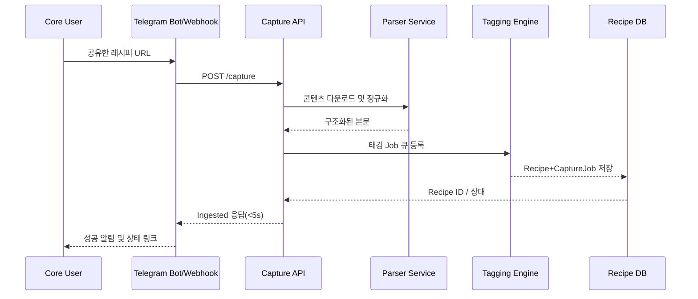
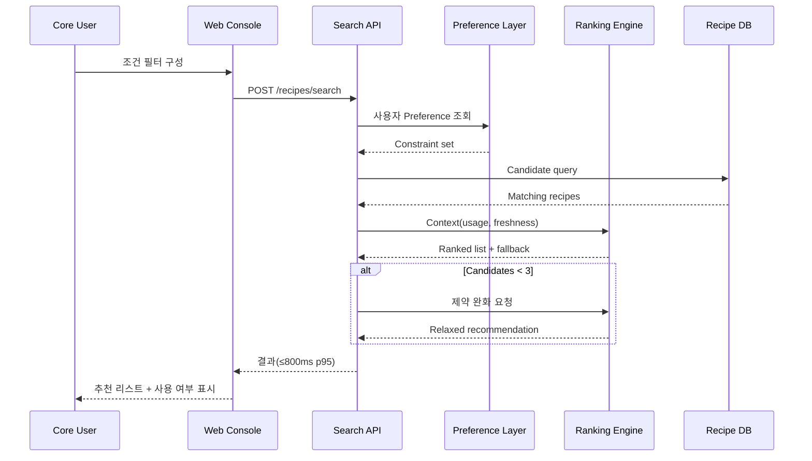
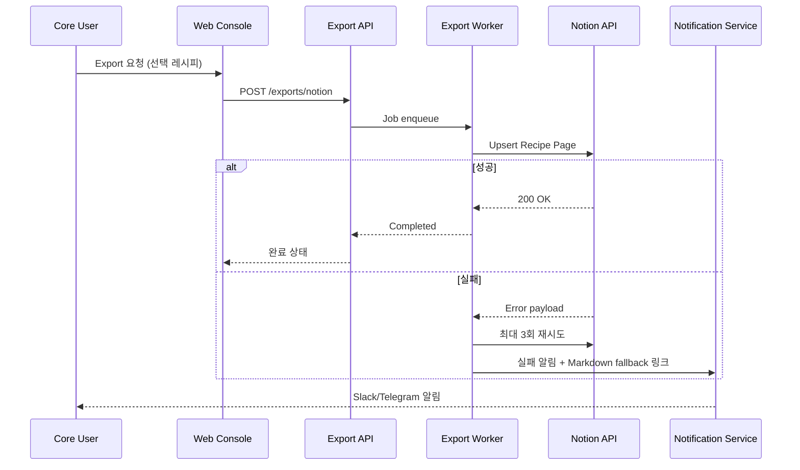
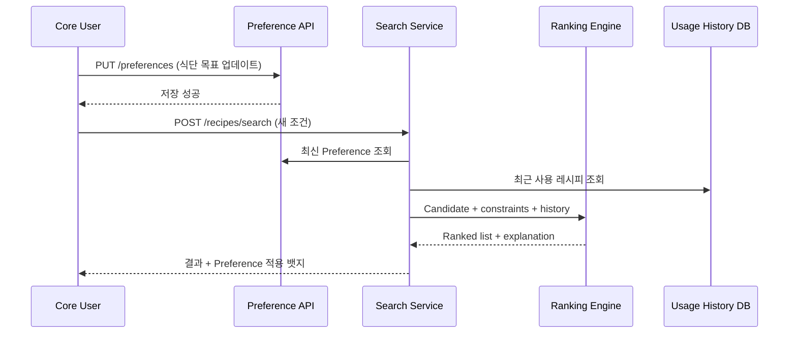

# Software Requirements Specification (SRS)
Document ID: SRS-001  
Revision: 1.0  
Date: 2025-11-18  
Standard: ISO/IEC/IEEE 29148:2018

---

## 1. Introduction

### 1.1 Purpose
본 문서는 디지털 레시피 OS(Multi-channel recipe capture, AI 기반 정규화, 조건 검색, Notion/Markdown Export) 시스템이 충족해야 하는 기능·비기능 요구사항을 ISO/IEC/IEEE 29148:2018 표준에 따라 명세한다. 출처는 `8-2_PRD_GPT_GEMINI_VPS참고산출.md` PRD이며, 시스템 설계·구현·검증·운영 팀이 공통으로 참조하는 단일 Source of Truth로 활용한다.

### 1.2 Scope (In-Scope / Out-of-Scope)
**In-Scope (v0.1)**
- YouTube/Instagram/Blog/수동 URL 기반 멀티 채널 캡처 및 중복 통합
- AI 태깅(재료/칼로리/제철/요리 종류)과 Nutrition 추론
- 표준 레시피 스키마 저장 및 Notion·Markdown Export
- 복합 조건 검색·즐겨찾기·최근 사용 기반 추천
- 온보딩 마법사, Preference Layer, 모니터링/알림 체계

**Out-of-Scope (v0.1)**
- 식단 추천 엔진, 자동 장보기 리스트, 가족 구성원별 맞춤
- 제휴 마트·배달·헬스케어 연동, 다국어 UI/컨텐츠
- 모바일 전용 앱, 온프레미스 배포, 장기 저장 아카이브

### 1.3 Definitions, Acronyms, Abbreviations
| Term | Definition |
| --- | --- |
| Core User | 디지털 미니멀리스트 성향의 레시피 OS 빌더(주 3회 이상 요리, 자동화 실험 성향) |
| RRCT | Recipe Retrieval Cycle Time (캡처→검색 완료까지 걸리는 총 시간) |
| AOS | Adjusted Opportunity Score. JTBD Pain/Desired Gain 기반 우선순위 지표 |
| Tag Confidence Score | 태깅 모델이 산출하는 0~1 확률 값. 0.7 이상을 “신뢰 가능”으로 정의 |
| Preference Layer | 식단 목표, 알레르기, 예산 등 사용자 제약 조건을 저장·적용하는 모듈 |
| Capture Job | 외부 URL 캡처 수행 단위. 상태(Ingested/Retry/Failed)와 지연(latency_ms)을 보유 |
| Export Job | Notion/Markdown 등 외부 싱크 수행 단위. 3회 재시도 후 실패 시 알림 |

### 1.4 References (REF-XX)
| ID | Title | Description |
| --- | --- | --- |
| REF-01 | `8-2_PRD_GPT_GEMINI_VPS참고산출.md` | 본 SRS 요구사항의 1차 출처(PRD) |
| REF-02 | `Value Proposition Sheet 를 PRD 로 추출하기.md` | PRD→SRS 매핑 가이드 및 용어 정의 |
| REF-03 | `디지털 미니멀리스트 프로젝트_레시피 편/[Gemini/GPT]-ValueProPositionSheet_gemini.md` | Gemini 기반 VPS 통찰(Pain/Gain) |
| REF-04 | `디지털 미니멀리스트 프로젝트_레시피 편/[Gemini/GPT]-ValueProPositionSheet_GPT5.1.md` | GPT5.1 기반 VPS 통찰(Pain/Gain) |
| REF-05 | `AOS X DOS 고통 만족도 평가 지수.md`, `TAM-SAM-SOM.md`, `페르소나 분석.md` | 시장 지표·세그먼트·페르소나 데이터 |
| REF-06 | `9-1_PRD에서_SRS_추출하기 방법.md` | ISO 29148 템플릿/시퀀스 다이어그램 작성 가이드 |

### 1.5 Assumptions & Constraints
- C-TEC-001: 프론트엔드는 Vite 기반 React/TypeScript를 사용하며, 모바일 뷰는 Responsive Web으로 처리한다.
- C-TEC-002: 백엔드 서비스는 Python 3.11 + FastAPI, 비동기 작업은 Celery + Redis로 구현한다.
- C-TEC-003: 영구 데이터 저장소는 PostgreSQL 15 (UTF8) + S3 호환 오브젝트 스토리지를 사용한다.
- C-TEC-004: AI 태깅/추론 파이프라인은 LangChain 기반 Python Worker로 실행하며, 주 1회 재학습 슬롯을 확보한다.
- C-TEC-005: 외부 LLM 호출은 OpenAI API 혹은 사내 LLM Gateway를 사용하고, OAuth 토큰·Notion Keys는 KMS에 저장한다.
- C-TEC-006: 내부 서비스 간 통신은 REST(OpenAPI 3.1) 또는 gRPC로 제한하며, Observability는 Grafana/Prometheus 스택을 사용한다.

---

## 2. Stakeholders
| Role | Responsibility | Interest / Success Criteria |
| --- | --- | --- |
| Product Owner / Builder Cell | 비전·우선순위 관리, KPI 추적 | RRCT 단축, 태깅 정확도, 베타 온보딩 완료율 |
| Core User (Recipe OS Builder) | 레시피 캡처·정리·검색 수행 | 60초 내 파이프라인 완료, 조건 검색 성공률, 스트레스 감소 |
| Data/ML Engineer | 태깅 모델 훈련·배치 운영 | 정확도≥90%, 재학습 주기 준수, 휴먼 QA 피드백 수렴 |
| Backend/API Engineer | 캡처·검색·Export API 설계/운영 | p95 SLA 준수, 실패율<0.5%, 보안 준수 |
| Customer Success & Support | 온보딩 지원, 알림/티켓 처리 | 온보딩 이탈률↓, 실패 알림 SLA<4h |
| External Platforms (Notion, Telegram, Social) | API 제공 및 정책 준수 | Rate limit 준수, 사용자 ToS 충돌 방지 |

---

## 3. System Context and Interfaces

### 3.1 External Systems
| System | Purpose | Interface / Constraint |
| --- | --- | --- |
| Notion API | 레시피 스키마 동기화 | OAuth Token 저장, Rate limit 3 req/sec |
| Telegram Bot API / Webhook | 사용자 캡처 채널 | HTTPS webhook, Bot Token rotation |
| YouTube / Instagram / Blog RSS | 원문 수집 | 공식 API 우선, 사용자 제공 HTML fallback |
| LLM Provider (OpenAI / Internal) | 태깅·영양 추론 | Async queue, 비용 모니터링, PII 마스킹 |
| OAuth Providers (Google/Meta) | 사용자 인증·채널 권한 | PKCE Flow, Token refresh 24h |

### 3.2 Client Applications
| Client | Description | Key Responsibilities |
| --- | --- | --- |
| Web Console (React) | 레시피 관리·검색 UI | 필터 구성, 상태 변경, Export 트리거 |
| Telegram Bot | 캡처 단축 인터페이스 | URL 수신, 상태 알림, 재시도 제안 |
| Notion Workspace | 최종 저장소 | DB 동기화, 사용자 정의 뷰 |
| Admin Console | 운영/모니터링 | 큐 상태, 실패 로그, 태그 QA |

### 3.3 API Overview
| Endpoint | Method | Description | Auth | Notes |
| --- | --- | --- | --- | --- |
| `/capture` | POST | 외부 URL/메모 캡처 요청 생성 | OAuth + Bot Token | Rate limit 30 req/min/user |
| `/capture/{jobId}` | GET | 캡처 진행 상태 조회 | OAuth | Retry 정책 노출 |
| `/recipes/{id}` | GET/PUT | 정규화 레시피 조회/수정 | OAuth + RBAC | Version lock, audit log |
| `/recipes/search` | POST | 복합 필터 검색 및 추천 | OAuth | 필터 조합 최대 6개 |
| `/exports/notion` | POST | 레시피 Export 트리거 | OAuth + Notion Token | 3회 재시도 후 실패 |
| `/preferences` | GET/PUT | Diet/예산/알레르기 관리 | OAuth | Validation + default template |
| `/metrics/health` | GET | 큐/태그 정확도 상태 | Service-to-service | Grafana scrape |

### 3.4 Interaction Sequences

#### 3.4.1 Multi-channel Capture Scenario
Program Scenario: Core User가 Telegram Bot에 레시피 URL을 공유하면 5초 이내 캡처·정규화가 완료되어 “Ingested” 상태를 반환해야 한다.

#### 3.4.2 Condition-based Search & Recommendation Scenario
Program Scenario: 사용자가 시즌/칼로리/예산 조건을 동시에 설정해 검색하면 800ms(p95) 이내 결과와 부족 시 완화 제약 추천을 받아야 한다.

---

## 4. Specific Requirements

### 4.1 Functional Requirements
| ID | Title | Priority | Description | Source | Acceptance Criteria | Verification |
| --- | --- | --- | --- | --- | --- | --- |
| REQ-FUNC-001 | 멀티 채널 캡처 처리 | Must | 최소 2개 채널 OAuth 연동 후 URL 캡처를 5초(p95) 내 Ingested 상태로 완료 | Story 1, F: Multi-channel capture | AC1: 95% 요청 5초 내 상태 전환, 실패 시 재시도 큐 등록 | Integration test + synthetic load |
| REQ-FUNC-002 | 중복 레시피 병합 | Must | 동일 URL/Normalized hash는 새 레코드 대신 View Count만 증가 | Story 1 | AC2: 중복 시 하나의 Recipe ID만 유지, Audit에 merge 로그 기록 | DB unit test + regression suite |
| REQ-FUNC-003 | 캡처 실패 복구 | Must | 외부 4xx/5xx 발생 시 3회 자동 재시도 및 사용자 알림 | Story 1 | AC3: 실패 감지 후 2초 내 알림, 재시도 후에도 실패 시 CS 큐 | Chaos test + alert verification |
| REQ-FUNC-004 | 재료 태깅 | Must | 재료 리스트가 있을 경우 90% 이상을 표준 Ingredient Catalog에 매핑 | Story 2, F: AI 태깅 | AC1: Confidence ≥0.7, 미매핑 항목은 수동 태깅 대기열로 이동 | Model eval + weekly QA sample |
| REQ-FUNC-005 | 칼로리 추론 | Must | 원문에 칼로리가 없어도 80% 이상 레시피에 ±10% 오차 내 추정 값 생성 | Story 2 | AC2: nutrition_estimate_kcal 필드 채움, 오차율 로깅 | Model eval + nutrition benchmark |
| REQ-FUNC-006 | Export 동기화 | Must | 사용자가 Export 요청 시 필수 필드를 3초 내 Notion/Markdown에 반영 | Story 2, F: 표준 스키마 | AC3: 제목/출처/태그/칼로리/이미지/메모 동기화, 실패율<0.5% | E2E test + Notion sandbox |
| REQ-FUNC-007 | 복합 필터 검색 | Must | 최대 6 조건 동시 적용 가능, 95% 요청에서 800ms(p95) 이내 응답 | Story 3, F: 고급 검색 | AC1: 시즌+칼로리+예산 필터 성공, 3개 이상 결과 노출 | Load test + functional test |
| REQ-FUNC-008 | 제약 완화 추천 | Must | 조건 미충족 시 영향도 가장 낮은 제약을 완화한 대안을 1초 내 제시 | Story 3 | AC2: Relaxed recommendation 제공, 완화 사유 UI 표시 | Scenario test |
| REQ-FUNC-009 | 사용 이력 기반 재정렬 | Should | “조리 완료” 표시된 레시피는 동일 조건 검색 시 하단으로 이동 | Story 3 | AC3: Completed flag 적용 시 상단 3개 모두 신규 레시피 | UI regression + unit test |
| REQ-FUNC-010 | 온보딩 마법사 | Should | 템플릿 선택·채널 연동·Preference 설정을 5분 내 완료 | F: 온보딩 마법사 | AC: Step-by-step wizard, 단계별 검증, 진행률 표시 | Usability test + analytics |
| REQ-FUNC-011 | Preference Layer 관리 | Should | 식단 목표/알레르기/예산 정보를 CRUD하고 검색/추천에 반영 | F: Preference Layer | AC: Validation rules 적용, 변경 즉시 검색 결과 반영 | API test + contract test |

### 4.2 Non-Functional Requirements
| ID | Category | Requirement | Acceptance / Metrics | Verification |
| --- | --- | --- | --- | --- |
| REQ-NF-001 | Performance | RRCT P50 ≤60초, P90 ≤90초 | 캡처→검색 전체 시간 이벤트 기반 측정 | Product analytics dashboard |
| REQ-NF-002 | Performance | 캡처 파이프라인 p95 ≤5초 | Capture API latency logs | Load test & tracing |
| REQ-NF-003 | Performance | 검색 API p95 ≤800ms | `/recipes/search` latency histogram | k6 + APM |
| REQ-NF-004 | Performance | Export p95 ≤3초, 실패율<0.5% | Export job metrics | Integration test + monitoring |
| REQ-NF-005 | Quality | 자동 태그 정확도@Top3 ≥90% | 휴먼 QA 50건/주 샘플 | QA sampling |
| REQ-NF-006 | Quality | 스키마 완성률 ≥75% | 필수 필드 동시 충족률 | Data quality dashboard |
| REQ-NF-007 | Reliability | 월 가용성 ≥99.5%, 캡처/정규화 실패율 <0.5% | Uptime report, error budget | SLO monitoring |
| REQ-NF-008 | Security | OAuth 토큰/KMS 암호화, TLS1.2+, RBAC, 감사로그 1년 보관 | Pen-test, key rotation quarterly | Security review |
| REQ-NF-009 | Cost | 베타 기간 월 인프라 비용 ≤USD 400 (500명) | FinOps report | Monthly cost audit |
| REQ-NF-010 | Observability | 큐 상태, RRCT, 태그 정확도, Export 실패율 5분 단위 알림 | Grafana alerts & Slack notifications | Alert runbook tests |

---

## 5. Traceability Matrix
| Story ID | Description | Related Functional Requirements | Related Non-Functional Requirements | Test Cases |
| --- | --- | --- | --- | --- |
| S1 | 멀티 채널 캡처 자동화 | REQ-FUNC-001, 002, 003 | REQ-NF-001, 002, 007, 008 | TC-001 Capture latency, TC-002 Dedup merge, TC-003 Retry alert |
| S2 | AI 태깅 및 스키마 정규화 | REQ-FUNC-004, 005, 006, 011 | REQ-NF-001, 004, 005, 006, 008 | TC-004 Ingredient tagging, TC-005 Nutrition accuracy, TC-006 Export completeness |
| S3 | 조건 기반 검색·추천 | REQ-FUNC-007, 008, 009 | REQ-NF-001, 003, 006, 007, 010 | TC-007 Multi-filter search, TC-008 Constraint relax, TC-009 Completed recipe re-rank |

---

## 6. Appendix

### 6.1 API Endpoint List
| Endpoint | Method | Request (Key Fields) | Response Highlights | Notes |
| --- | --- | --- | --- | --- |
| `/capture` | POST | `source_type`, `url`, `notes`, `channel_token` | `job_id`, `status`, `latency_ms` | Supports Telegram webhook + REST |
| `/capture/{jobId}` | GET | Path param `jobId` | `status`, `retry_count`, `error_payload` | Polling & webhook callbacks |
| `/recipes/{id}` | GET | Path param `id` | Canonical recipe object | Includes tags, nutrition, usage stats |
| `/recipes/{id}` | PUT | Recipe payload diff | Updated recipe | Requires editor role |
| `/recipes/search` | POST | `filters[]`, `sort`, `limit`, `context` | Ranked recipes, relaxed constraints | Limit 50 items |
| `/preferences` | GET/PUT | diet_goal, allergy, budget_cap, favorite_sources | Stored preference doc | Validates enumerations |
| `/exports/notion` | POST | `recipe_ids[]`, `target_db`, `format` | `export_job_id`, status | Markdown fallback on failure |
| `/metrics/health` | GET | none | Queue depth, RRCT stats, tag accuracy | Auth via service token |

### 6.2 Entity & Data Model
#### Recipe
| Field | Type | Description |
| --- | --- | --- |
| `id` | UUID | Primary key |
| `title` | Text | Recipe title |
| `source_type` | Enum(Youtube/Instagram/Blog/Manual) | Capture origin |
| `source_url` | Text | Original URL |
| `author` | Text | Author or channel |
| `hero_image` | URL | Cover image |
| `instructions_md` | Markdown | Normalized steps |
| `cook_time_minutes` | Integer | Prep + cook time |
| `servings` | Integer | Default servings |
| `status` | Enum(Draft/Ingested/Completed) | Workflow state |

#### Ingredient
| Field | Type | Description |
| --- | --- | --- |
| `recipe_id` | UUID (FK) | Links to Recipe |
| `canonical_name` | Text | Catalog name |
| `quantity` | Decimal | Amount |
| `unit` | Text | Measurement unit |
| `cost_estimate` | Decimal | Optional cost |
| `confidence` | Float | Mapping confidence |

#### Tag
| Field | Type | Description |
| --- | --- | --- |
| `recipe_id` | UUID (FK) | Recipe reference |
| `tag_type` | Enum(season, diet, macro, cuisine) | Tag category |
| `value` | Text | Tag value |
| `confidence` | Float | Probability score |

#### NutritionProfile
| Field | Type | Description |
| --- | --- | --- |
| `recipe_id` | UUID (FK) | Recipe reference |
| `kcal` | Integer | Calories |
| `protein_g` | Decimal | Protein grams |
| `fat_g` | Decimal | Fat grams |
| `carb_g` | Decimal | Carbohydrates |
| `sugar_g` | Decimal | Sugar grams |
| `fiber_g` | Decimal | Fiber grams |
| `estimation_error_pct` | Decimal | Absolute error vs ground truth |

#### UserPreference
| Field | Type | Description |
| --- | --- | --- |
| `user_id` | UUID | Owner |
| `diet_goal` | Enum(weight_loss, glucose_control, seasonal, budget) | Primary objective |
| `allergy` | JSON array | Excluded ingredients |
| `budget_cap` | Integer | KRW per dish |
| `favorite_sources` | JSON array | Preferred channels |
| `updated_at` | Timestamp | Last change |

#### CaptureJob
| Field | Type | Description |
| --- | --- | --- |
| `job_id` | UUID | Primary key |
| `source` | Enum | Capture channel |
| `status` | Enum(Queued, Ingested, Retry, Failed) | Processing state |
| `latency_ms` | Integer | Duration |
| `error_payload` | JSON | Failure data |
| `retry_count` | Integer | Auto retry attempts |

### 6.3 Detailed Interaction Models

#### 6.3.1 Notion Export & Recovery Sequence

#### 6.3.2 Preference-aware Recommendation Loop

---

**End of Document**

